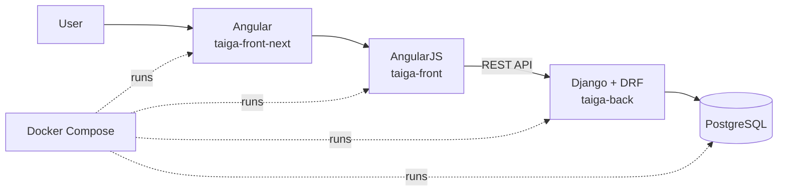

# Taiga Schedule Management

An academic extension of Taiga focused on project schedule planning and
tracking, featuring an activity list, an interactive Gantt chart,
dependencies, critical path analysis, and granular permissions.

> This is an independent project based on
> [Taiga](https://github.com/taigaio). It is not an official distribution and
> is not affiliated with the Taiga maintainers.

<!--
When the media assets are ready, add a Markdown image here pointing to
portfolio/demo.gif.
-->

## Overview

This project adds schedule management capabilities to Taiga and integrates
them across the Django/DRF backend, the legacy AngularJS frontend, and the
Angular navigation shell.

Key capabilities:

- activity list with filters, search, sorting, and configurable columns;
- interactive Gantt chart with date editing, zoom, and hierarchical
  reordering;
- activity dependencies and cascading date propagation;
- critical path and slack calculation;
- activity colors, explicit editing states, and undo/redo support;
- persistent ordering with protection against concurrent position conflicts;
- separate permissions for viewing, dates, dependencies, colors, and
  reordering;
- server-side permission enforcement.

## My contribution

The work presented in this portfolio focuses on the Schedule and Gantt
extensions and their cross-component integration. The original Taiga code
remains credited and preserved in the corresponding Git histories.

| Component | Responsibility in this project |
| --- | --- |
| `taiga-back` | Persistence, APIs, chronological rules, permissions, and ordering |
| `taiga-front` | Activity list, Gantt chart, and scheduling interactions |
| `taiga-front-next` | Navigation and module exposure in the modern shell |
| `taiga-docker` | Integrated local development environment |

For a narrative account of the technical decisions and challenges, see the
[case study](docs/case-study.md). For the component boundaries and data flow,
see the [architecture documentation](docs/architecture.md).

## Architecture overview



## Repository layout

```text
.
├── components/       Source code managed as Git submodules
├── infrastructure/   Docker Compose and local gateway
├── scripts/          Setup, build, run, and test commands
├── docs/             Case study and technical documentation
├── portfolio/        Placeholders for screenshots, diagrams, and demo media
└── demo/             Guidance for reproducible demo data
```

## Running locally

Prerequisites:

- Git;
- Docker with Docker Compose;
- Node and NVM only when rebuilding `taiga-front-next`.

Clone and prepare the environment:

```bash
git clone --recurse-submodules \
  https://github.com/MatLaft/taiga-schedule-management.git
cd taiga-schedule-management
./scripts/setup.sh
```

Start the application:

```bash
./scripts/start.sh
```

The application will be available at
[http://localhost:9000](http://localhost:9000).

If a persistent local database already exists, the credentials in `.env` must
match those used when its Docker volume was first initialized. Do not remove
the database volume unless its data is disposable.

To rebuild the modern frontend web component:

```bash
./scripts/build-front-next.sh
```

See the [testing guide](docs/testing.md) for validation commands.

## Submodules and upstream contributions

Each directory under `components/` is an independent repository. Changes
intended for the official project must be submitted as separate pull requests
to the corresponding Taiga repository. Updating a submodule pointer in this
orchestration repository does not transfer its internal commits upstream.

## Visual assets

The media directories currently contain only naming conventions and
instructions. See the [portfolio assets guide](portfolio/README.md) before
adding screenshots or the demo GIF.

## License and attribution

See [LICENSE](LICENSE), [NOTICE.md](NOTICE.md), and the license files inside
each component. Code derived from Taiga must continue to comply with the
applicable terms of the Mozilla Public License 2.0.
